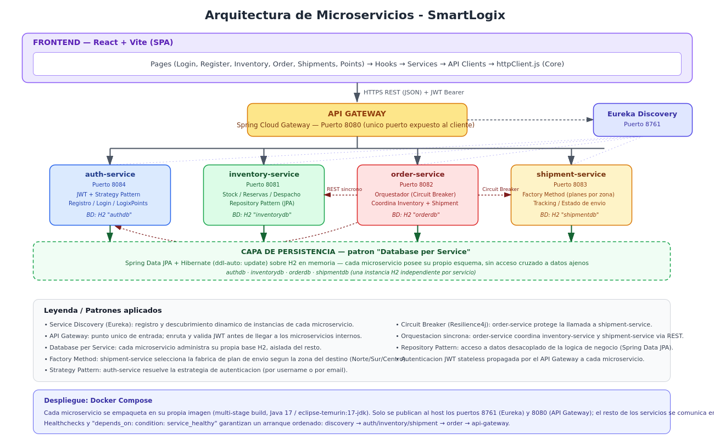

# Informe Técnico Evaluación 3 — SmartLogix


**Plataforma de gestión logística para PYMEs eCommerce**

Integrantes: Ashley Vargas · Mirko Lucic — Desarrollo Fullstack III, DUOC UC

---

## 1. Introducción

SmartLogix es una plataforma de gestión logística para PYMEs de eCommerce, que permite administrar inventario, procesar pedidos y coordinar envíos. Está compuesta por un **frontend en React**  y un **backend de microservicios en Spring Boot**.

Patrones aplicados: **Service Discovery** (Eureka), **API Gateway**, **Database per Service**, **Factory Method** (shipment-service), **Circuit Breaker** (order-service → shipment-service, con Resilience4j) y **orquestación síncrona** de pedidos.

## 2. Arquitectura

El frontend solo se comunica con el **API Gateway** (puerto 8080), que enruta cada petición según su ruta (`/api/auth`, `/api/inventory`, `/api/orders`, `/api/shipments`) hacia el microservicio correspondiente, resuelto dinámicamente vía **Eureka** (`discovery-service`, puerto 8761). Cada microservicio valida el JWT de forma local (stateless) y persiste su información en su propia base H2.



| Componente | Puerto | Responsabilidad |
|---|---|---|
| discovery-service | 8761 | Registro y descubrimiento de servicios (Eureka) |
| api-gateway | 8080 | Punto único de entrada y enrutamiento |
| auth-service | 8084 | Login, JWT, LogixPoints |
| inventory-service | 8081 | Catálogo y stock |
| order-service | 8082 | Pedidos; orquesta inventario y envío |
| shipment-service | 8083 | Envíos y planes por zona |

**Flujo de un pedido:** cliente → `order-service` valida stock en `inventory-service` → reserva unidades → solicita envío a `shipment-service` → responde con `trackingCode`.

**Login:** `POST /api/auth/login` → `auth-service` emite JWT → el frontend lo guarda y lo envía como `Authorization: Bearer <token>` en cada petición.

## 3. Persistencia de Datos

Cada microservicio usa **Spring Data JPA + Hibernate** sobre una base **H2 en memoria propia** (Database per Service). No se usan procedimientos almacenados.

| Microservicio | Base H2 | DDL | Entidad principal |
|---|---|---|---|
| auth-service | authdb | create-drop | UserEntity |
| inventory-service | inventorydb | update | InventoryItem |
| order-service | orderdb | update | PurchaseOrder / OrderLine |
| shipment-service | shipmentdb | update | Shipment |

## 4. Frontend

React 19 + Vite 8, proyecto NPM estándar, consume únicamente el API Gateway.

- **api/** — peticiones HTTP (`httpClient.js`, `inventoryApi.js`, etc.)
- **service/** — reglas de negocio y sesión
- **pages/** — Login, Register, Inventory, Order, Shipments, Points
- **components/**, **hooks/**, **layouts/**, **utils/**

Flujo típico: `Página.jsx → hook → service → api → httpClient → API Gateway`.

## 5. Backend

Proyecto Maven multimódulo (Java 17, Spring Boot 3.3.5, Spring Cloud 2023.0.3), seis microservicios con la misma estructura por capas: `controller / service / domain / dto / repository / security / exception`.

## 6. API REST — Endpoints principales

| Servicio | Endpoints clave |
|---|---|
| Auth | `POST /api/auth/register`, `POST /api/auth/login`, `GET /api/auth/validate` |
| Inventory | `GET/POST /api/inventory/items`, `.../{sku}/availability`, `.../reserve`, `.../release`, `.../dispatch` |
| Order | `POST /api/orders`, `GET /api/orders`, `GET /api/orders/{orderNumber}` |
| Shipment | `POST /api/shipments`, `GET /api/shipments`, `GET /api/shipments/{trackingCode}` |

**Ejemplo — crear pedido:**
```
POST /api/orders
{ "customerName": "Ana Torres", "customerEmail": "ana@cliente.cl",
  "shippingAddress": "Av. Providencia 1234, Santiago",
  "lines": [{ "sku": "SKU-1001", "quantity": 2, "unitPrice": 29990 }] }

→ 201 { "orderNumber": "ORD-4F2A9C1B", "status": "CONFIRMED", "trackingCode": "TRK-88213", ... }
```

## 7. Repositorios

- **Frontend:** https://github.com/Ashleymvg/Ev3FullStack3-SmartLogix-Front.git
- **Backend:** https://github.com/Ashleymvg/Ev3FullStack3-SmartLogix-Back.git

Las instrucciones de instalación, ejecución y pruebas de cada componente están en el README de su respectivo repositorio.
